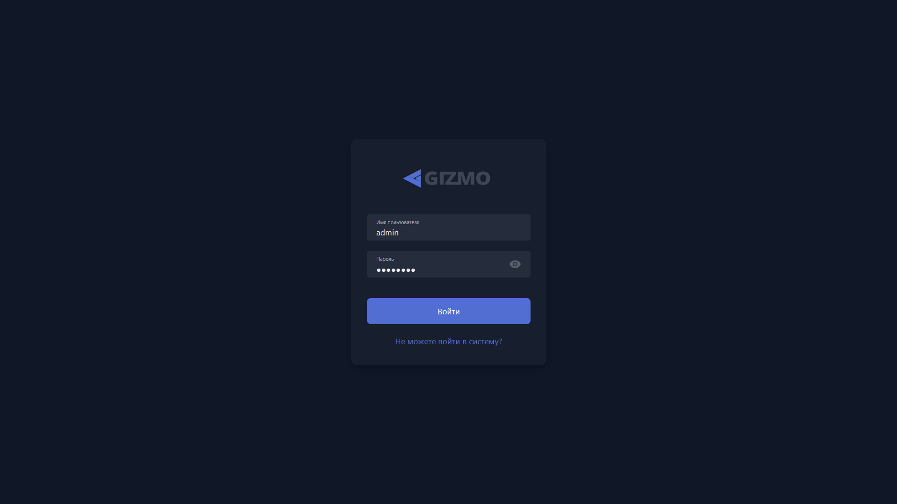
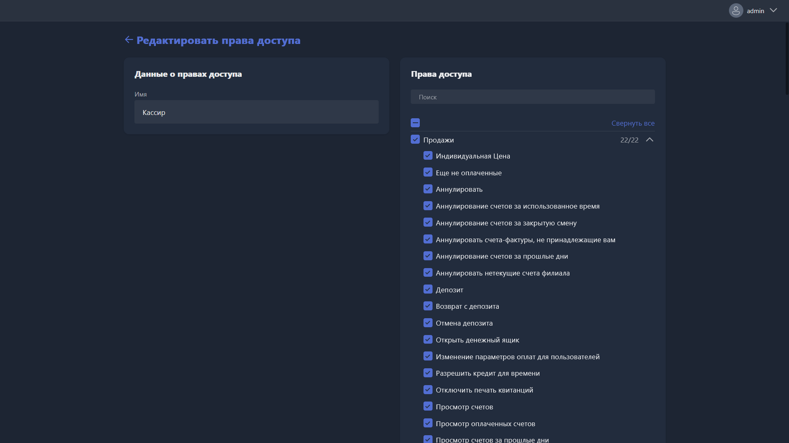
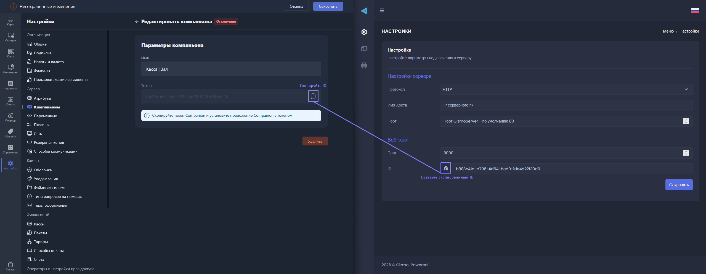
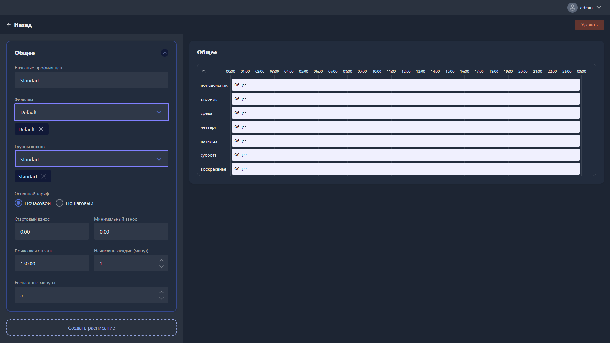
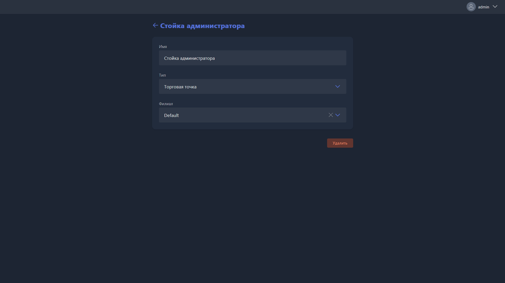
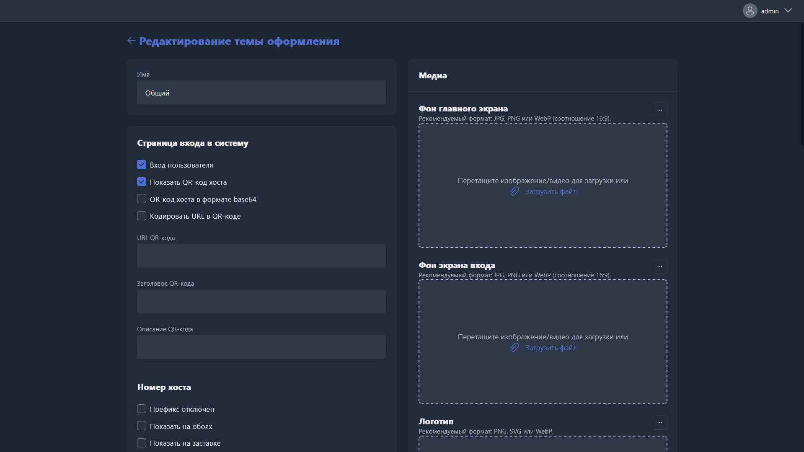
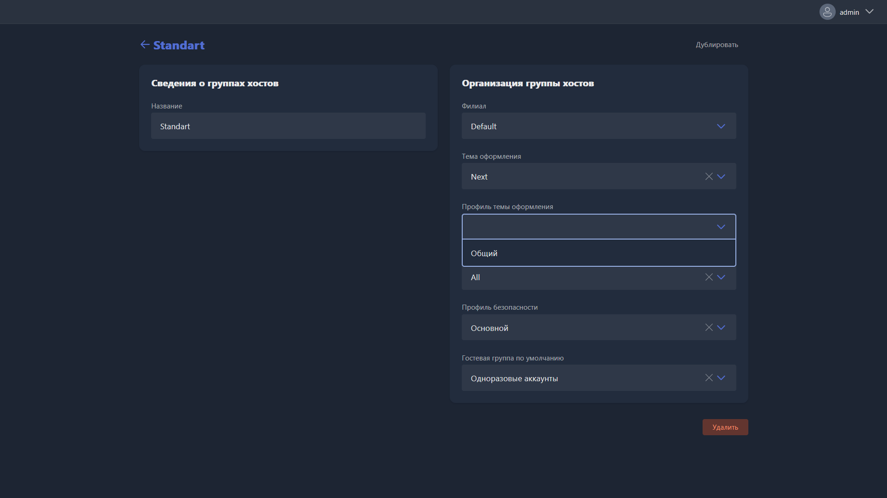
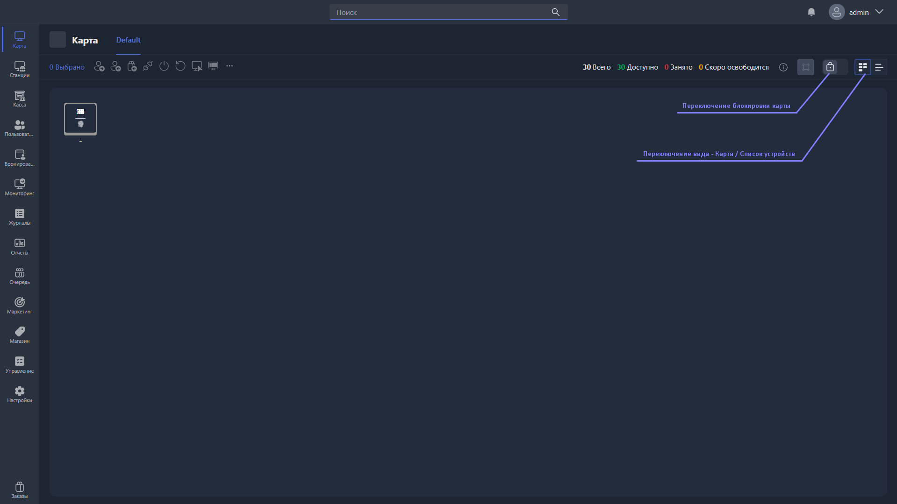

<html>

  

  

    

      <svg xmlns="http://www.w3.org/2000/svg" width="24" height="24" viewBox="0 0 24 24" fill="none" stroke="currentColor" stroke-width="2" stroke-linecap="round" stroke-linejoin="round"><path d="M6 22a2 2 0 0 1-2-2V4a2 2 0 0 1 2-2h8a2.4 2.4 0 0 1 1.704.706l3.588 3.588A2.4 2.4 0 0 1 20 8v12a2 2 0 0 1-2 2z"/><path d="M14 2v5a1 1 0 0 0 1 1h5"/></svg>
      В этом блоке вы узнаете
    

    <h2 class="gx-title">
      Как обновить ваш клуб на Gizmo V3
    </h2>
    

      30–50 минут
      /
      Высокая сложность
    

  

</html>

<color color="#fc7b03">**Это сложное руководство, и оно может вызывать трудности на некоторых этапах. При любых вопросах рекомендуем <fragment-link id="ThoZh">обратиться в поддержку</fragment-link>, или доверить все нам, создав заявку на обновление клуба -- это бесплатно.**</color>

<color color="#99B1E6">**Новая версия кардинально отличается от предыдущей -- менеджер переехал в браузер, появилась работа с несколькими филиалами в одном пространстве, полностью поменялась система лояльности, и многое, многое другое. Чтобы вы могли быстро и без потерь перейти на V3, мы подготовили пошаговую инструкцию.**</color>

> [!WARNING]
> 
> **Перед началом миграции настоятельно рекомендуем сделать резервную копию базы данных и проводить обновление в нерабочее для клуба время -- часть настроек придётся указать заново.**

## Обновление сервера

-  Загрузите и установите установщик нового сервера. Старую версию удалять не нужно, достаточно пройти все шаги в установщике.

-  Запустите сервер как консольное приложение или [как службу](./../usage/gizmo-server/run-modes.md).

> [!WARNING]
> 
> При первом запуске может возникнуть ошибка -- чтобы исправить ее, просто закройте приложение и откройте снова

-  Теперь можно открыть новый **GizmoManager** по адресу `https://gizmo.local/apps/manager`. Эта ссылка будет актуальна для всего времени работы, поэтому если вам привычнее опыт использования десктопных приложений, [установите менеджер как приложение](./gizmomanager-as-an-app.md).

-  Авторизуйтесь под учетной записью оператора -- подойдет любой аккаунт, так как права доступа временно сброшены.

{width=1919px height=1079px}

-  Выберите филиал -- сейчас вам будет доступен только Default, так как он создался по умолчанию при обновлении.

> [!NOTE]
> 
> Филиалы -- это новая функция разделения заведений, подключенных к одному серверу, что позволяет сетям клубов объединить их в экосистему с общей базой пользователей, настройками, администраторами и другим функционалом

-  Выберите кассу, через которую работаете. Касса -- это пк, с которого администратор совершает продажи. Управлять ими можно в настройках.

**После успешной авторизации вы наконец попадете на карту управления клубом. Можно включить долгожданную темную тему, открыв профиль оператора в верхнем правом углу. Не спешите начинать работу, ведь есть еще несколько важных моментов, которые нужно проверить.**

## 2\. Обновление основных настроек

Менеджер был полностью переработан, поэтому часть функций переехала в новое расположение, часть -- изменена, а часть вовсе появилась впервые.

Чтобы выбрать **русский язык интерфейса**, перейдите в **Settings -> Organization -> General** и укажите язык, часовой пояс и страну в региональных настройках. Сохраните изменения и перезагрузите страницу. Рекомендуем также указать всю информацию об организации.

Чтобы переименовать текущий филиал, перейдите в раздел **Настройки -> Организация -> Филиалы**, укажите новое имя и сохраните изменения.

### 2\.1 Права оператора

Права оператора теперь привязаны не к конкретному оператору, а к **группе прав доступа** -- группу достаточно создать один раз и указать её в настройках профиля каждого оператора.

1. Перейдите в раздел **Настройки -> Операторы и настройки прав доступа -> Права доступа** и нажмите **«Создать право доступа»**. Укажите название группы -- например, «Кассир», «Управляющий», «Руководитель» -- и выберите нужные права доступа. Узнать, что означает то или иное право можно, наведя на него курсором.

{width=1919px height=1079px}

1. Здесь же перейдите в раздел **Операторы**. Для каждого оператора укажите:

   -  **Филиал**, к которому он привязан.

   -  Предустановку прав доступа.

> [!WARNING]
> 
> Для имён операторов появились ограничения -- в них нельзя использовать пробелы, а длина должна составлять не менее 5 символов.
>
> После добавления новых прав текущему оператору нужно выйти из системы и авторизоваться заново.

### 2\.2 Финансовые настройки, сканер и файлы

В логику работы точки продаж внесено много изменений -- разберём все по пунктам.

Теперь поддерживается работа с несколькими **кассами** **и терминалами** в одном клубе. Для работы этой системы необходимо установить небольшое приложение на каждую точку продаж (пк администратора) в клубе.

-  В GizmoManager перейдите в **Настройки -> Другое -> О** **программе** и скачайте Gizmo Companion.

-  Установите её на пк, с которого будете совершать продажи, и дважды нажмите на ярлык Gizmo Companion на рабочем столе.

-  В полях **Протокол**, **Имя хоста** и **Порт** укажите данные для подключения к вашему серверу Gizmo.

-  В менеджере перейдите в раздел **Настройки -> Сервер -> Компаньоны** и нажмите **«Создать Companion»**, указав имя (например, расположение точки продаж).

-  Откройте созданный компаньон, скопируйте токен и укажите его в настройках Gizmo Companion, затем сохраните изменения. При успешном подключении статус компаньона сменится на **«Подключено»**.

{width=2558px height=993px}

Теперь привяжем созданный компаньон к рабочему месту -- **кассе**:

-  Перейдите в раздел **Настройки -> Финансовый -> Кассы**. Здесь вы увидите множество ранее созданных касс -- это имена всех пк, с которых когда-либо подключались к серверу.

> [!TIP]
> 
> Вы можете удалить все кассы и создать только нужные, чтобы очистить этот раздел.

-  Укажите в кассе **Филиал**, **Компаньон**, **Номер** и **Имя**.

<color color="#99B1E6">**Только для клубов с подключенным к gizmo ККТ или терминалом эквайринга:**</color>

-  Откройте **Настройки -> Финансовый -> Кассы**, выберите кассу, с которой будете работать, и укажите в ее параметрах номер принтера фискальных чеков (ККТ) / терминала эквайринга -- нумерация указана в KKMServer.

-  Перейдите в **Настройки -> Организация -> Налоги и валюта** и укажите **Валюту по умолчанию**, а также заполните все поля в подразделе **Настройки налогов компании**. Сохраните изменения.

> [!NOTE]
> 
> Если интеграция с ККМ-сервером ранее настраивалась нашими специалистами -- <fragment-link id="ThoZh">обратитесь в чат поддержки</fragment-link> на сайте, мы подскажем нужные данные для ввода.

**Готово -- теперь сканер и ККМ-сервер связаны с Gizmo Companion, который, в свою очередь, привязан к кассе.**

> [!IMPORTANT]
> 
> **Инструкция по полной настройке Компаньона** [**доступна здесь**](./../usage/gizmo-companion/_index.md)**.**

### 2\.3 Пакеты времени, товары и тарифы

Раньше тариф (поминутное списание) создавался отдельно и мог быть привязан к группе пользователей или переопределён для групп хостов. Теперь при создании тарифа его нужно привязать сразу к **филиалу** (клубу) и **группе станций (Standart, VIP и т.п.)** в нём:

1. Перейдите в раздел **Настройки -> Финансовый -> Тарифы**.

2. Дважды нажмите на тариф, который будет использоваться для группы (групп) хостов.

3. Укажите **Филиал** и **группы станций**, на которых этот тариф будет действовать.

{width=1919px height=1079px}

> [!NOTE]
> 
> Возможно, ранее у вас было несколько тарифов для клиентов со скидками -- например, Standart 10%
>
> Так как скидочная система была переработана, эти тарифы больше не нужны, их можно удалить. Настройку лояльности мы разберем ниже, в разделе **Маркетинга**.

### 2\.4 Склад и учёт товаров

С поддержкой нескольких филиалов появилась возможность разделить склад между ними:

1. Перейдите в раздел **Магазин -> Склады** и выберите склад **Default**, созданный по умолчанию.

2. Переименуйте его и укажите **Филиал**, к которому он будет привязан.

3. Сохраните изменения.

{width=1919px height=1079px}

> [!IMPORTANT]
> 
> При настройке склада вы могли заметить, что доступны два его типа -- **Торговая точка** и, непосредственно, **Склад**. Выбранный тип не влияет на функциональность склада, это лишь визуальное удобство, позволяющее различать Торговые точки (например, холодильник у стойки администратора), и Склады (например, подсобка в клубе или даже полноценное складское помещение для крупных сетей клубов).

### 2\.5 Опции оболочки

Опции оболочки -- скрытие разделов в клиенте, фоновое изображение и другие настройки из Gizmo Server Configuration Wizard -- переехали в менеджер.

> [!WARNING]
> 
> **Эти настройки не переносятся автоматически при миграции с V2 на V3 -- их нужно указать заново.**

-  Перейдите в раздел **Настройки -> Клиент -> Темы Оформления** и создайте новый **Профиль оформления** с нужными настройками для групп хостов. Сохраните его, и выйдите из настроек.

{width=1919px height=1079px}

-  Перейдите в **Станции -> Группы станций** и укажите профиль темы оформления для каждой группы станций.

-  Сохраните изменения.

{width=1919px height=1079px}

Требования для клиентов при регистрации (длина пароля, заглавные буквы, спецсимволы, цифры) находятся в разделе **Настройки -> Клиент -> Оболочка**.

> [!IMPORTANT]
> 
> Подробнее о всех возможностях настройки профиля оболочки мы рассказываем в [этой статье](./../configure/client/skins/skin-profile.md). 

### 2\.6 Скидочные тарифы и ценообразование

**Логика скидок, которая раньше жила внутри каждого пакета времени/товара, а также переопределение профилей цен для групп хостов и пользователей, переехала в новый раздел «Маркетинг». В нём появилось три новых пункта:**

-  **Скидка** -- универсальный объект, ее можно задать на отдельный товар/услугу/тариф, на товарную группу или даже на способ оплаты, а также указать условия, при которых скидка применяется.

-  **Скидочные группы** -- набор скидок, который можно привязать к группе пользователей.

-  **Акции** -- промокоды, которые клиент может активировать у администратора или через оболочку, и получить скидку / группу скидок.

То есть группе пользователей назначается не конкретная скидка, а **Скидочная группа**, внутри которой уже собрано несколько **Скидок**.

Если раньше у вас были скидки на товары, пакеты или тарифы -- ниже пошаговые инструкции, как настроить их заново.

<tabs>

<tab name="Скидка на пакеты времени">

**Рассмотрим на примере -- добавляем скидку 10% на пакеты времени для группы пользователей «Постоянники 10%».**

1. Перейдите в раздел **Маркетинг -> Скидки**, нажмите **«Создать Скидку»**.

2. Укажите имя и включите доступность для вашего филиала.

3. В разделе **Целевые группы -> Активация группы** укажите **«Любой»** -- скидка будет действовать при выполнении условия хотя бы для одной из добавленных групп назначения, а не для всех сразу.

4. Добавьте **Группу назначения** -- **«Пакеты»** -- и выберите (кнопкой **\+**) пакеты времени, для которых должна действовать скидка.

5. В разделе **Условие активации** укажите **«Любой»** -- скидка сработает, если в корзину добавлен любой из указанных пакетов.

6. В разделе **Вознаграждение** выберите **«Скидка»**.

7. В поле **Применить к** выберите **«Строка заказа»** -- тогда скидка применится только к пакету времени, а не ко всем позициям заказа.

8. Укажите **Тип расчёта** -- **«Процент»** -- и сам процент скидки в разделе **Сумма**.

9. Сохраните скидку.

10. Перейдите в раздел **Маркетинг -> Скидочные группы**, создайте **Группу скидок**, укажите её имя и выберите созданную скидку.

11. Перейдите в раздел **Пользователи -> Группы пользователей**, дважды нажмите на группу «Постоянники 10%» и укажите для неё созданную группу скидок.

**Готово -- теперь при добавлении указанных пакетов в корзину стоимость автоматически пересчитается для клиентов из группы «Постоянники 10%».**

</tab>

<tab name="Скидка на тарифы">

**Рассмотрим на примере -- добавляем скидку 10% на тариф для группы пользователей «Постоянники 10%».**

1. Перейдите в раздел **Маркетинг -> Скидки**, нажмите **«Создать Скидку»**.

2. Укажите имя и включите доступность для вашего филиала.

3. В разделе **Целевые группы -> Активация группы** укажите **«Любой»**.

4. Добавьте **Группу назначения** -- **«Тарифы»** -- и выберите (кнопкой **\+**) тарифы, для которых должна действовать скидка.

5. В разделе **Условие активации** укажите **«Любой»**.

6. В разделе **Вознаграждение** выберите **«Скидка»**.

7. В поле **Применить к** выберите **«Строка заказа»**.

8. Укажите **Тип расчёта** -- **«Процент»** -- и процент скидки в разделе **Сумма**.

9. Сохраните скидку.

10. Перейдите в раздел **Маркетинг -> Скидочные группы**, создайте **Группу скидок**, укажите её имя и выберите созданную скидку.

11. Перейдите в раздел **Пользователи -> Группы пользователей**, дважды нажмите на группу «Постоянники 10%» и укажите для неё созданную группу скидок.

**Готово -- теперь при использовании одного из указанных тарифов клиент из группы «Постоянники 10%» автоматически получит скидку.**

</tab>

</tabs>

### 2\.7 Разное

**Небольшие настройки, которые нужны для комфортной работы**

-  Параметр, отвечающий за автовход клиента после неожиданного перезапуска его устройства не переносится при обновлении, при необходимости стоит включить его вручную, перейдя в **Настройки -> Клиент -> Оболочка -> Сеанс пользователя -> Автоматический повторный вход пользователя/гостя**.

-  Чтобы пользоваться удаленным доступом к клиентским пк, сначала перейдите в **Настройки -> Сервер -> Сеть,** в поле **Имя хоста** укажите IP или DNS имя сервера в локальной сети, либо просто **gizmo.local**, если не знаете, что вписывать.

> [!NOTE]
> 
> gizmo.local автоматически определяет, какой IP у вашего сервера. Это может приводить к чуть более медленной загрузке удаленного доступа и некоторых других функций. Для максимальной скорости рекомендуем указать IP или DNS имя вручную.

-  Настоятельно рекомендуем включить все пункты в **Настройках -> Сеть -> Правила подключения**, так как они не переносятся при обновлении.

## **Итог**

**Поздравляем! Вы почти у цели и завершили все сложные пункты руководства.** **Для комфортной работы осталось настроить карту клуба -- отключите ее блокировку, нажав на соответствующую иконку, и расставьте устройства так, как вам удобно. Нажмите на ту же кнопку, чтобы вернуть блокировку. Там же можно переключиться с графического представления на простой список устройств.**

{width=1919px height=1079px}

<color color="#99B1E6">**На этом обновление завершено. В руководстве перечислена только краткая конфигурация для начала работы, инструкции по взаимодействию с остальными функционалом вы можете найти в нашей большой базе знаний. А если возникают вопросы или трудности -- <fragment-link id="ThoZh">обязательно напишите нам</fragment-link>.**</color>