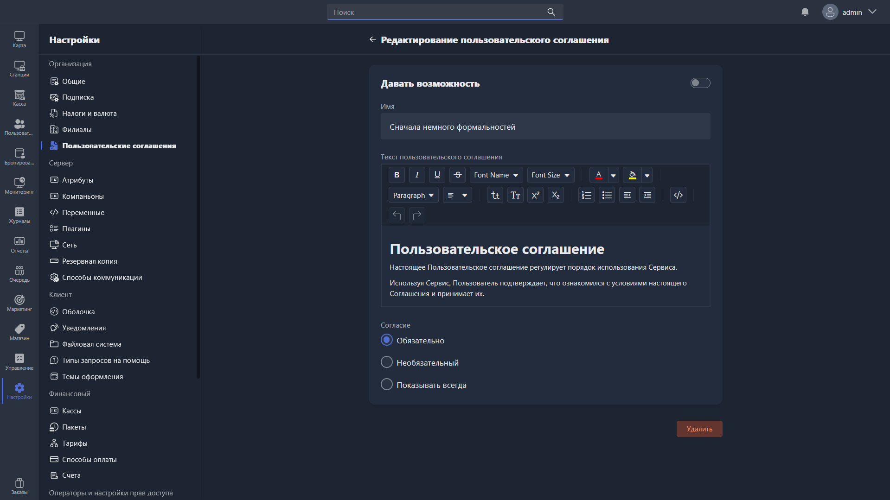

<html>

<head>
<meta charset="UTF-8">
<meta name="viewport" content="width=device-width, initial-scale=1.0">

</head>

<body>
  <section class="gx-hero">
    

      <svg xmlns="http://www.w3.org/2000/svg" width="24" height="24" viewBox="0 0 24 24" fill="none" stroke="currentColor" stroke-width="2" stroke-linecap="round" stroke-linejoin="round" class="lucide lucide-file-text-icon lucide-file-text"><path d="M6 22a2 2 0 0 1-2-2V4a2 2 0 0 1 2-2h8a2.4 2.4 0 0 1 1.704.706l3.588 3.588A2.4 2.4 0 0 1 20 8v12a2 2 0 0 1-2 2z"/><path d="M14 2v5a1 1 0 0 0 1 1h5"/><path d="M10 9H8"/><path d="M16 13H8"/><path d="M16 17H8"/></svg>
      В этом блоке вы узнаете
    

    <h1 class="gx-title">
      Как настроить создать и оформить пользовательское соглашение для клуба в Gizmo
    </h1>

    

      3–5 минут
      Низкая сложность
    

  </section>

</body>

</html>

**Пользовательское соглашение -- это условия предоставления услуг вашего заведения, с которыми клиент обязан согласиться при регистрации или первом входе в систему. Использовать его можно не только для юридических документов, но и чтобы показать гостю правила клуба, либо вовсе сделать приветственное окно интерактивным, добавив свои кнопки или изображения.**

## Как настроить

-  Откройте **Gizmo Manager** -> **Настройки** -> **Организация** -> **Пользовательские соглашения**.

-  В разделе  нажмите **Создать пользовательское соглашение**.

{width=1919px height=1079px}

-  Заполните заголовок и текст соглашения. Вы можете менять его через удобный редактор, либо переключиться в режим просмотра кода, чтобы использовать HTML формат -- для этого нажмите на кнопку <icon code="code-xml"/>

> [!TIP]
> ### В чем плюсы HTML формата?
> HTML код позволит вам создать полноценную веб страницу в пользовательском соглашении. Это открывает любые возможности в плане оформления, интерактивности и соответствия документа брендбуку клуба.

-  В пункте **Согласие** выберите тип появления пользовательского соглашения.

<table header="none">
<tr>
<td>

**Обязательно**

</td>
<td>

*Клиент будет обязан согласиться с офертой при регистрации или первом входе в аккаунт.*

</td>
</tr>
<tr>
<td>

**Необязательно**

</td>
<td>

*Клиент может закрыть окно оферты, не соглашаясь с ней.*

</td>
</tr>
<tr>
<td>

**Показывать всегда**

</td>
<td>

*Соглашение будет требоваться не только при регистрации, но и **при каждом** входе в аккаунт*

</td>
</tr>
</table>

-  **Сохраните** изменения.

**Готово -- соглашение сразу начнёт применяться ко всем новым клиентам.**