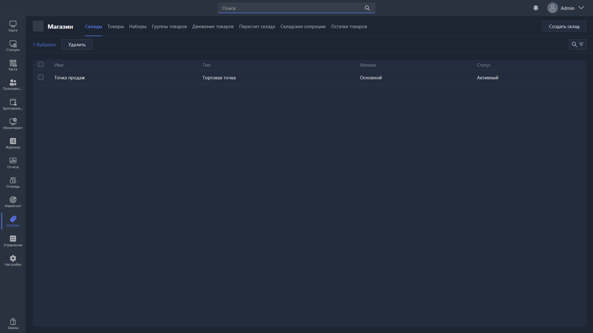
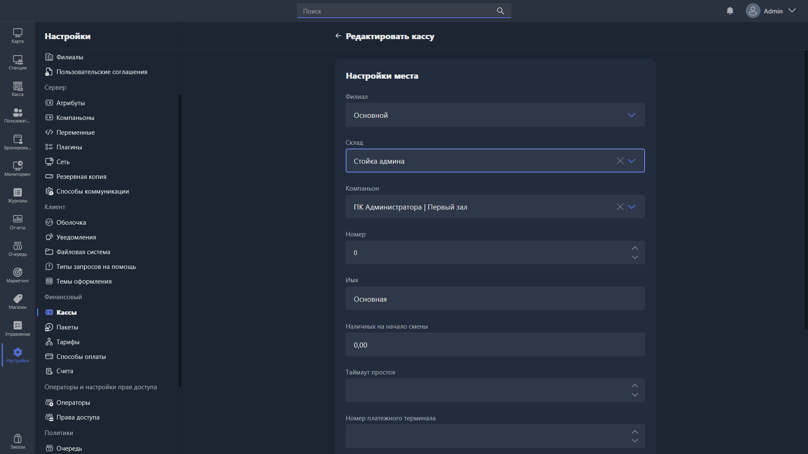
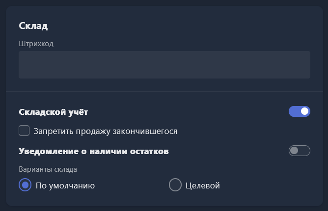
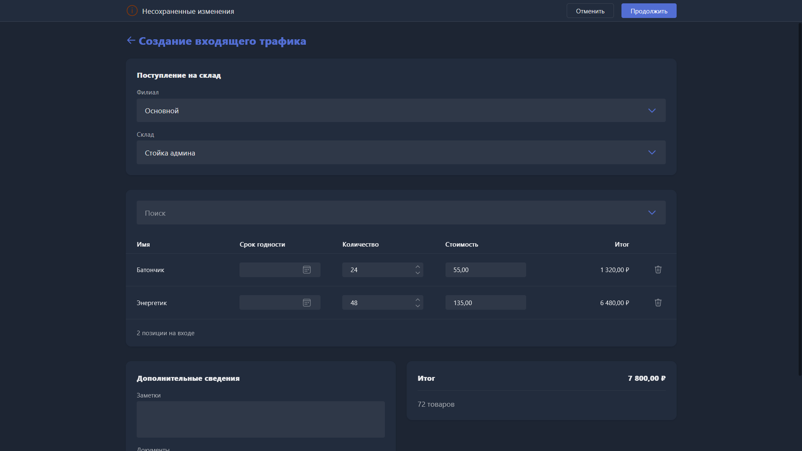
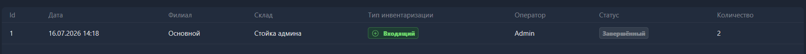
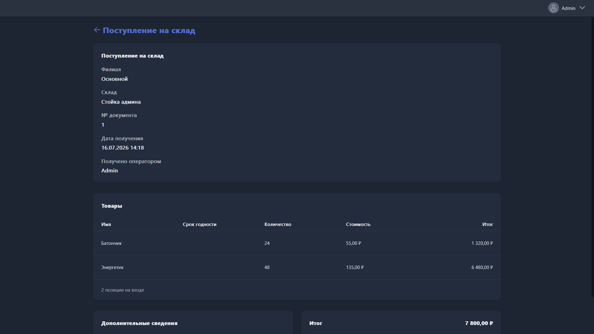
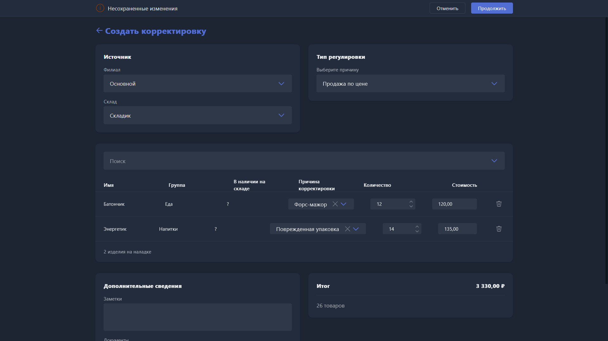

<html>

  

  

    

      <svg xmlns="http://www.w3.org/2000/svg" width="24" height="24" viewBox="0 0 24 24" fill="none" stroke="currentColor" stroke-width="2" stroke-linecap="round" stroke-linejoin="round"><circle cx="9" cy="21" r="1"/><circle cx="19" cy="21" r="1"/><path d="M3 4h2l2.5 12.5a2 2 0 0 0 2 1.5h8a2 2 0 0 0 2-1.5L21 8H6"/></svg>
      В этом блоке вы узнаете
    

    <h2 class="gx-title">Как контролировать остатки товаров и управлять складом</h2>
    

      15–20 минут
      /
      Средняя сложность
    

  

</html>

При продаже товаров через Gizmo часто нужно контролировать их остатки -- вовремя замечать, что пора пополнить запас, и находить расхождения из-за ошибок или недобросовестных действий операторов. Для этого и служит склад: он считает остатки товаров и позволяет проводить операции пополнения и списания.

## Как настроить склад

Убедитесь, что у вас создан хотя бы один склад в <cmd text="Магазин"/> -> <cmd text="Склады"/>, и что он привязан к нужному филиалу.

{width=1919px height=1079px}

Разберём, какие параметры есть в настройках склада:

-  **Имя** -- произвольное название склада, например «Стойка администратора».

-  **Тип** -- «Торговая точка» или «Склад». Функционально эти типы никак не отличаются и нужны только для визуального удобства. Торговую точку рекомендуем назначать для места продажи на стойке администратора -- например, холодильника с напитками или витрины со снеками. Склад -- для подсобного помещения в клубе или отдельного складского пространства.

-  **Филиал** -- к какому клубу относится этот склад. Один склад не может относиться больше чем к одному филиалу.

Теперь привяжем склад к кассе (месту продажи), чтобы товары, проданные с этой точки, списывались именно с него.

-  Откройте <cmd text="Настройки"/> -> <cmd text="Кассы"/> и выберите кассу, которая относится к вашей точке продаж.

-  В карточке кассы привяжите нужный склад и примените изменения.

   {width=1919px height=1079px}

## Как включить учёт товаров на складе

Склад настроен, но товары в нём не появятся, пока вы явно не включите их учёт. Для этого перейдите в <cmd text="Магазин"/> -> <cmd text="Товары"/>, поочерёдно откройте карточку каждого товара, который хотите добавить на склад, пролистайте вниз и включите складской учёт.

Дополнительные параметры:

-  **Запретить продажу закончившегося** -- не даёт продать товар, если его остаток на складе равен нулю.

-  **Уведомление о наличии остатков** -- предупреждает администратора, когда количество товара опускается ниже критического порога.

-  **Варианты склада** -- что именно списывается при продаже:

   -  **По умолчанию** -- списывается только сам товар.

   -  **Целевой** -- вместе с товаром дополнительно списывается другой выбранный товар в указанном количестве -- например, стакан или соломинка при продаже напитка.

{width=668px height=430px}

## Как пополнять и списывать товары со склада

Поступления и списания товаров проходят через <cmd text="Магазин"/> -> <cmd text="Складские операции"/>. Нажмите <cmd text="Складская операция"/> в правом верхнем углу и выберите тип операции:

-  **Входящий** -- пополнение склада или принятие перевода с другого филиала или склада.

-  **Перевод** -- перемещение товаров из одного склада в другой. Полезно для сети из нескольких филиалов, или если в одном клубе несколько складов и нужно контролировать перемещения между ними.

-  **Корректировка** -- списание указанного количества товаров со склада: обычное списание, продажа по себестоимости или продажа по цене, указанной в карточке товара.

Разберём каждый тип операции подробнее.

### Пополнение

Выберите тип операции **Входящий**.

При этом станет доступен способ поступления -- **«Вручную»** (выбрать товары и их количество для ручного поступления) или **«Из перемещения»** (создать поступление из уже созданного перевода с другого склада или филиала). Если переводами между складами и филиалами вы не пользуетесь, выбирайте «Вручную».

-  Выберите филиал и склад, который хотите пополнить.

-  В поиске товаров укажите все товары, их количество и себестоимость (из накладной, можно указать 0), а также срок годности, если это нужно.

В дополнительных сведениях прикрепите документы (например, накладную), если это нужно -- потом их можно будет посмотреть, и добавьте заметку по желанию.

Нажмите <cmd text="Продолжить"/> вверху экрана -- операция выполнится и появится в списке складских операций, откуда всегда можно проверить историю операций со складом и посмотреть прикреплённые документы.

{width=1919px height=1079px}

{width=1801px height=121px}

{width=1919px height=1079px}

### Перевод между складами

Выберите тип операции **Перевод**.

-  В открывшемся меню укажите филиал и склад, с которого будут переданы товары, а также филиал и склад, в который они будут переданы. Флажок **Автоматически принять товар** сразу перемещает товары без необходимости их подтверждать. Рекомендуем включать, но можно оставить выключенным, если, например, вы передаёте товары между филиалами и управляющему другого филиала нужно подтвердить приёмку.

-  Выберите все товары для перемещения и их количество. Учтите: сейчас нет ограничения на перемещение, поэтому можно увести склад, с которого перемещаете, в минус.

-  Укажите причину перемещения и дополнительные сведения, если это нужно.

Если при создании перевода вы по той или иной причине не включили «Автоматически принять товар», для приёмки откройте <cmd text="Складские операции"/> -> <cmd text="Входящий"/>, выберите способ поступления «Из перемещения» и саму операцию перевода, которая появилась после его создания.

### Списание со склада

Выберите тип операции **Корректировка**.

-  В открывшемся меню укажите филиал и склад, с которым будете работать.

-  Выберите причину корректировки -- списание, продажа по себестоимости или продажа по основной цене товара.

-  Укажите все товары, причину корректировки по каждому, количество и стоимость списания (она попадёт в кассу, указывайте 0, если нужно списать товар без оплаты).

-  Внесите дополнительные сведения, если это нужно, и нажмите <cmd text="Продолжить"/>.

{width=1919px height=1079px}

## Инвентаризация

Если вы хотите сравнить ожидаемое системой количество товара (рассчитанное по всем продажам и пополнениям) с реальным наличием на складе, проведите инвентаризацию. Для этого откройте <cmd text="Магазин"/> -> <cmd text="Пересчёт склада"/> и создайте новую инвентаризацию.

-  Выберите филиал и склад, в котором будете проводить инвентаризацию.

-  Укажите фактическое количество всех товаров на складе, при необходимости заполните комментарии и примечания.

-  Нажмите <cmd text="Продолжить"/>, сверьте данные и подтвердите инвентаризацию -- она появится в списке раздела «Пересчёт склада».

## Другие полезные разделы

При работе со складом пригодятся ещё две вкладки:

-  <cmd text="Магазин"/> -> <cmd text="Остатки товаров"/> -- текущие остатки товаров на всех доступных вам складах и филиалах.

-  <cmd text="Магазин"/> -> <cmd text="Движение товаров"/> -- все операции с товарами: пополнения, списания, продажи, переводы и любые другие действия.