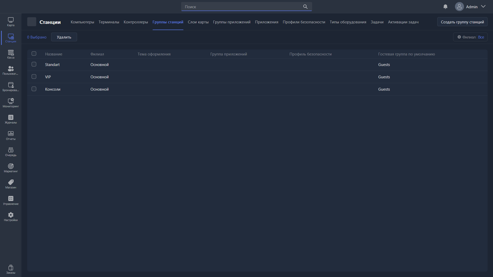

{width=1919px height=1079px}

Раздел отвечает за управление и создание групп станций. Это группы игровых мест, к которым можно привязывать тарифы (почасовую оплату), пакеты времени, профили безопасности и другие параметры.

-  Удалить -- удаляет выбранные группы станций.

-  Создать группу станций -- создает новую группу и открывает карточку ее редактирования.