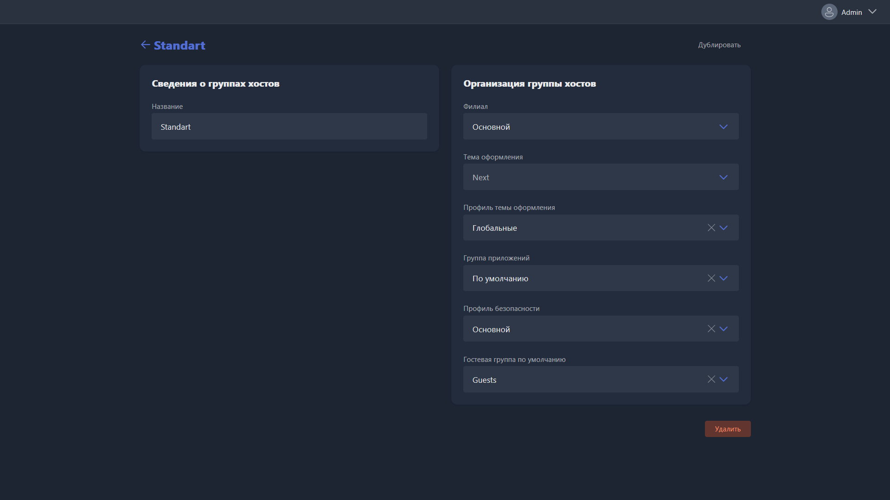

{width=1919px height=1079px}

Данный раздел открывается при редактировании существующей или создании новой группы станций.

-  Название -- наименование группы станций.

-  Филиал -- филиал, к которому привязана группа станций.

-  Тема оформления -- глобальная тема (скин), которая используется для этой группы.

-  Профиль темы оформления -- конкретный профиль темы оформления, который используется для этой группы. Позволяет переопределять его для разных групп, тем самым настраивая разное оформление и другие различия для разных групп станций в клубе.

-  Группа приложений -- приложения, объединенные группой, которые будут доступны на этом устройстве. Если каких-то приложений из группы приложений нет по указанным путям на конкретных игровых местах, они все равно не будут там отображаться.

-  Профиль безопасности -- профиль, который будет привязан к этой группе станций.

-  Гостевая группа по умолчанию -- группа пользователей, которая будет использоваться для входа одноразовых (гостевых) учетных записей на этой группе станций.