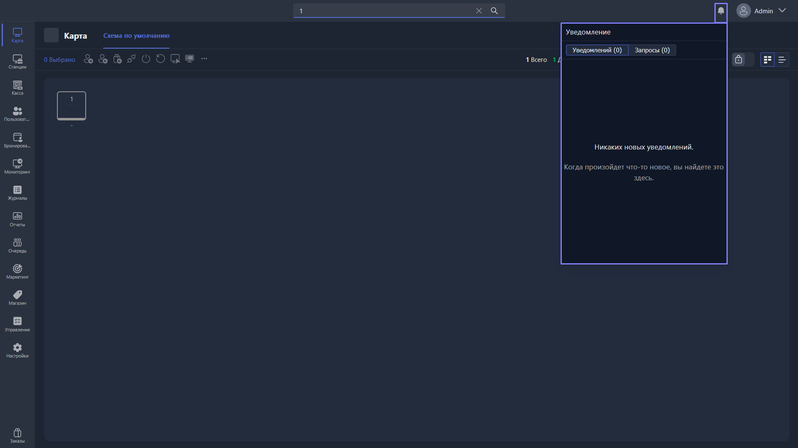

{width=1919px height=1079px}

Открываются в правом верхнем углу экрана приложения, слева от логина аккаунта администратора. Уведомляют администратора о запросах помощи от клиентов, заказах, обновлениях и других событиях.

Доступны два раздела окна уведомлений:

-  **Уведомления** (количество) -- уведомления о заказах, обновлениях и других событиях.

-  **Запросы** (количество) -- запросы помощи от клиентов.