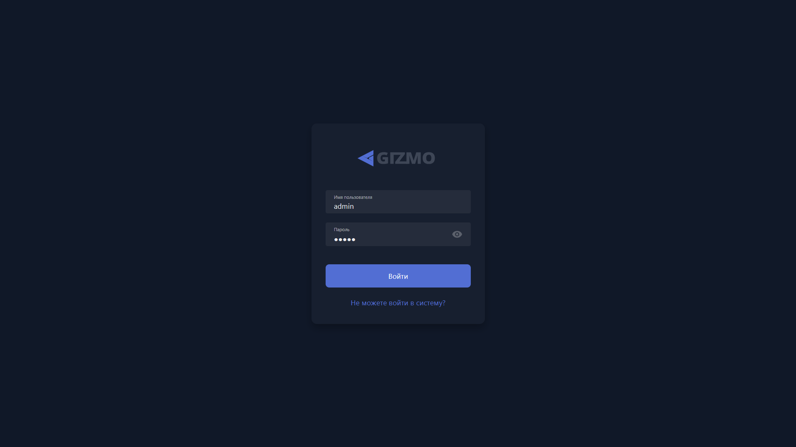

{width=1919px height=1079px}

Главный экран авторизации. Здесь нужно указать **Имя пользователя** и **Пароль** оператора, чтобы войти в аккаунт. Учётные данные с клиентского сайта не подойдут -- доступ дают только учётные данные, выданные оператору.

Не рекомендуем использовать простые пароли или пароли по умолчанию, и при создании [учётной записи оператора](./../../configure/operators-and-permissions/operators/_index.md) формировать надежный пароль для вас и ваших сотрудников.