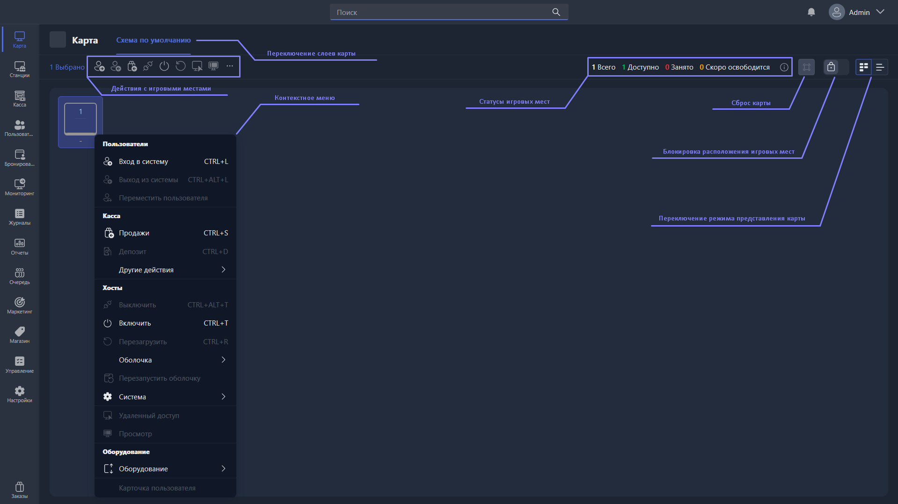

{width=1919px height=1079px}

Раздел предназначен для управления игровыми местами клуба.

Экран представляет собой схему зала: каждое игровое место обозначено плиткой с номером и текущим состоянием. Над схемой расположены панель инструментов, счётчики занятости и переключатель слоёв карты.

При выборе любого игрового места или сразу нескольких доступны следующие действия, сгруппированные по категориям:

### Пользователи:

-  **Вход в систему** -- ручная авторизация аккаунта пользователя или одноразовой учётной записи.

-  **Выход из системы** -- деавторизация пользователя.

-  **Переместить пользователя** -- позволяет пересадить пользователя на другое игровое место. При нажатии будет предложено выбрать игровое место, куда клиент будет пересажен. После пересадки на игровом месте, с которого пересадили пользователя, выполняется [действие при выходе из системы](./../../../configure/client/shell.md) -- то, которое задано в настройках оболочки клиента.

### Касса:

-  **Продажи** -- откроет окно продажи с автовыбором этого игрового места, если на нём никого нет (при этом создастся гость, которого вы сможете авторизовать). Если на ПК авторизован зарегистрированный аккаунт, откроется окно продажи на этот аккаунт.

-  **Депозит** -- пополняет депозит авторизованного пользователя. Недоступно, если на ПК нет авторизованного клиента.

#### Другие действия ->

-  **Закрыть баланс** -- система выходит из аккаунта клиента, автоматически закрывает и выставляет для оплаты все его счета.

-  **Возврат с депозита** -- позволяет вернуть средства с депозита. Доступно только если на ПК авторизован клиент. Очень опасно использовать при подключённом фискальном принтере.

-  **Варианты выставления счетов** -- ???

### Хосты:

-  **Выключить** -- выключает ПК, если он включён.

-  **Включить** -- отправляет запрос на включение ПК по сети, если он отключён.

-  **Перезагрузить** -- перезапускает ПК, если он включён.

> [!NOTE]
> 
> Функция Wake on Lan не сработает, если для клиентского ПК не настроен Wake On Lan -- [подробнее в статье](./../../../tutorials/kak-nastroit-wol.md).

#### Оболочка ->

-  **Включить режим администратора** -- вводит ПК в режим полного доступа, снимает всю безопасность и сворачивает клиентскую оболочку, предоставляя доступ к операционной системе.

-  **Выключить режим администратора** -- выводит ПК из режима полного доступа.

-  **Перезапустить оболочку** -- перезагружает оболочку Gizmo Client, не перезапуская сам клиентский ПК.

#### Система ->

-  **Заблокировать** -- блокирует ПК. Если в этот момент на нём развёрнута оболочка, перекрывает её интерфейс надписью «Заблокировано». Если включён режим администратора и оболочка свёрнута, блокирует ввод с клавиатуры и мыши на этом ПК.

-  **Разблокировать** -- снимает блокировку.

-  **В рабочем состоянии** -- выводит ПК из режима нерабочего состояния.

-  **Не в рабочем состоянии** -- вводит ПК в режим нерабочего состояния. В этом режиме технически на ПК ничего не меняется, но если на нём открыта оболочка, её интерфейс перекрывается, и клиент видит надпись «неисправен».

-  **Вкл. безопасность** -- включает профили безопасности на ПК, если они отключены.

-  **Откл. безопасность** -- отключает на ПК профили безопасности, если они включены.

-  **Удаленный доступ** -- открывает страницу удалённого доступа к этому ПК в режиме управления. Его интерфейс разобран в статье [«Удалённый доступ»](./remote-access.md).

-  **Просмотр** -- открывает страницу удалённого доступа, но в режиме просмотра. Менять режим управления и просмотра можно кнопкой в интерфейсе удалённого доступа. Режим просмотра позволяет случайно не перехватить курсор или ввод клавиатуры пользователя, чтобы не помешать ему пользоваться устройством.

### Оборудование:

-  **Получить** -- позволяет забрать у пользователя на выбранном игровом месте выданное ему оборудование.

-  **Выдать** -- позволяет выдать пользователю на выбранном игровом месте оборудование.

-  **Карточка пользователя** -- открывает карточку авторизованного на ПК клиента. Доступно, если на ПК кто-то авторизован.

> [!NOTE]
> 
> Эти параметры дублируются как в контекстном меню, открываемом правой кнопкой мыши, так и в верхней панели инструментов.

### Также на карте доступны следующие элементы:

-  **Переключение слоев карты**, созданных в <cmd text="Станции"/> -> <cmd text="Слои карты"/> -- переключает слои карты с игровыми местами на них. Позволяет удобно разделять, например, этажи клуба или его зоны.

-  Статусы всех игровых мест:

   -  **Всего** -- сколько всего игровых мест доступно оператору.

   -  **Доступно** -- сколько игровых мест свободно для авторизации.

   -  **Занято** -- сколько игровых мест на данный момент занято клиентами.

   -  **Скоро освободится** -- сколько игровых мест освободится в течение 5 минут.

-  Кнопка информации с описанием всех статусов и иконок на карте клуба.

-  Кнопка **«Сбросить»**, доступная только при снятии режима блокировки карты. Если доступна, сбрасывает все игровые места в изначальное положение на карте.

-  **Режим блокировки карты** -- по умолчанию находится во включённом состоянии. Если снять его, переключив режим, блокировка карты снимется. В этом режиме можно перемещать игровые места по карте. После перемещения необходимо переключить режим блокировки обратно.

-  **Переключение режима представления карты** -- по умолчанию находится в графическом режиме, при котором игровые места располагаются по импровизированной карте и могут быть перемещены по ней. Можно переключить в режим списка -- в таком случае все игровые места идут списком по выбранному фильтру.
