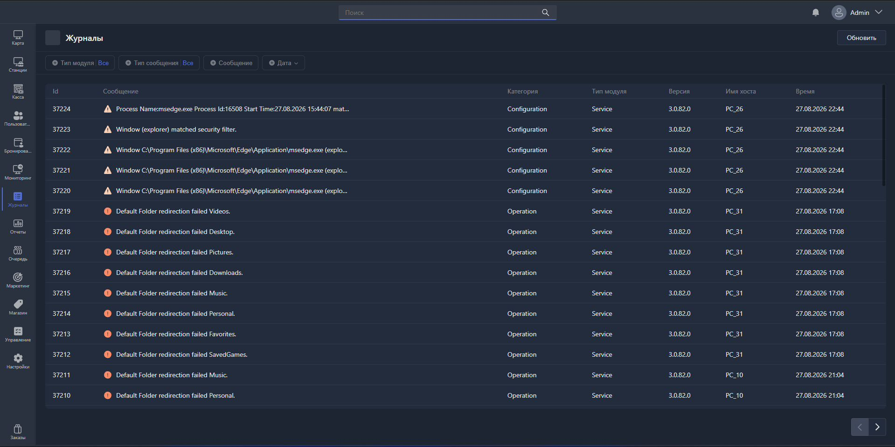

{width=1919px height=961px}

Раздел «Журналы» собирает служебные записи о работе Gizmo: что делали составные части системы, какие события произошли, где возникли ошибки. Сюда стоит обратиться, когда требуется понять, почему что-то повело себя не так.

Раздел открывается кнопкой <cmd text="Журналы"/> в левом меню.

Экран состоит из строки фильтров сверху и таблицы записей под ней.

## Таблица записей

Каждая строка -- одна запись журнала.

-  **Id** -- номер записи. Каждая запись нумеруется по порядку возрастания числа и отображается первой в списке.

-  **Сообщение** -- текст записи: что именно произошло, краткое описание ошибки.

-  **Категория** -- к какой части системы относится запись.

-  **Тип модуля** -- какая программа сделала запись: сервис, менеджер, клиент или веб-менеджер.

-  **Версия** -- версия программы, сделавшей запись.

-  **Имя хоста** -- хост, к которому привязано событие.

-  **Время** -- дата возникновения записи в журнале.

Записи показываются по 50 на страницу. Переход между страницами осуществляется стрелками "\< >" в правом нижнем углу страницы.

При открытой странице записи не появляются в режиме «онлайн». Чтобы принудительно проявить новые записи в журнале, нажмите <cmd text="Обновить"/> в правом верхнем углу.

## Фильтры

Фильтры стоят в строке над таблицей и работают вместе: если задать несколько, останутся записи, подходящие сразу под все условия.

### Тип модуля

Оставляет записи только от выбранной части системы.

-  **Все** -- без ограничения и фильтрации по нужной системе.

-  **Сервис** -- Gizmo Server, то есть сама серверная служба.

-  **Менеджер** -- приложение Gizmo Manager.

-  **Клиент** -- Gizmo Client на игровых машинах.

-  **Веб-менеджер** -- Gizmo Manager, открытый в браузере.

### Тип сообщения

Оставляет записи выбранной важности по доступным фильтрам:

-  **Все**

-  **Информация**

-  **Предупреждение**

-  **Ошибка** 

-  **Событие**

### Сообщение

Ищет записи по тексту. Введите слово или его часть в поле, оставьте условие **Содержит** и нажмите <cmd text="Применить"/>.

Поиск идёт по колонке «Сообщение» -- по тому самому тексту, который видно в таблице.

### Дата

Ограничивает выборку по времени. Слева -- позволяет задать период, справа -- два календаря и поля времени для точных границ.

-  **Пользовательское** -- произвольный отрезок: выберите начальную и конечную дату в календарях, при необходимости уточните время.

-  **Больше, чем** -- всё, что позже указанного момента.

-  **Меньше, чем** -- всё, что раньше указанного момента.

-  **За день**, **За неделю**, **За месяц**, **За год** -- готовые периоды, отсчитываемые назад от текущего момента.

Выбранный период вступает в силу по кнопке <cmd text="Применить"/>, отменяется -- по кнопке <cmd text="Отмена"/>.

Если после сброса всех фильтров таблица по-прежнему пуста, значит, система ещё не записала ни одного события -- так бывает на только что развёрнутом сервере.