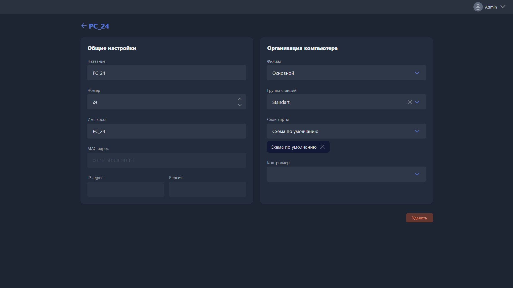

{width=1919px height=1079px}

Данная карточка открывается при ручном создании нового или редактировании существующего пк.

-  Название -- наименование пк в Gizmo.

-  Номер -- номер пк в Gizmo.

-  Имя хоста -- имя пк в системе Windows. Если в Настройках > Сеть включена функция Восстанавливать имена хостов, Gizmo будет назначать это имя для пк в Windows при каждом подключении.

-  MAC адрес -- MAC устройства. Зависит от сетевой карты пк.

-  IP адрес -- текущий IP пк в локальной сети. Отображается только если пк запущен и подключен.

-  Версия -- текущая версия Gizmo Client на этом пк. Отображается только если пк запущен и подключен.

-  Филиал -- филиал клуба, в котором должен отображаться этот пк.

-  Группа станций -- группа, к которой привязан этот пк. От этого зависит стоимость почасовой оплаты, разрешения для пакетов времени (если настроено), профили безопасности и другие.

-  Слои карты -- слои, на которых пк отображается в разделе Карты.

-  Контроллер -- привязанный к пк контроллер, если такой есть.