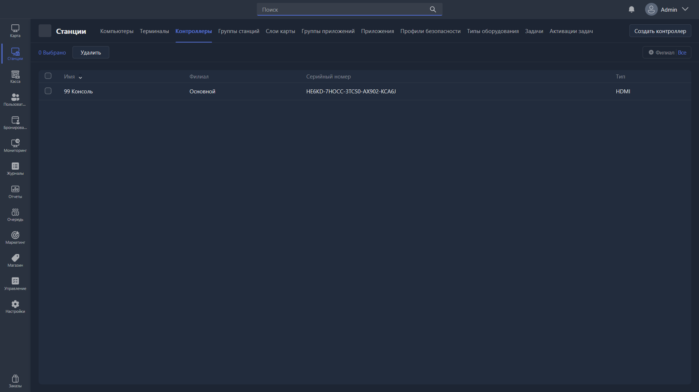

{width=1919px height=1079px}

Данный раздел отвечает за создание и редактирование контроллеров Gizmo -- это устройства, которые позволяют удаленно включать и выключать HDMI сигнал на экран. Чаще всего используются для экранов консолей, чтобы контролировать время.

-  Удалить -- удаляет выбранные контроллеры.

-  Создать контролер -- создает карточку контроллера.