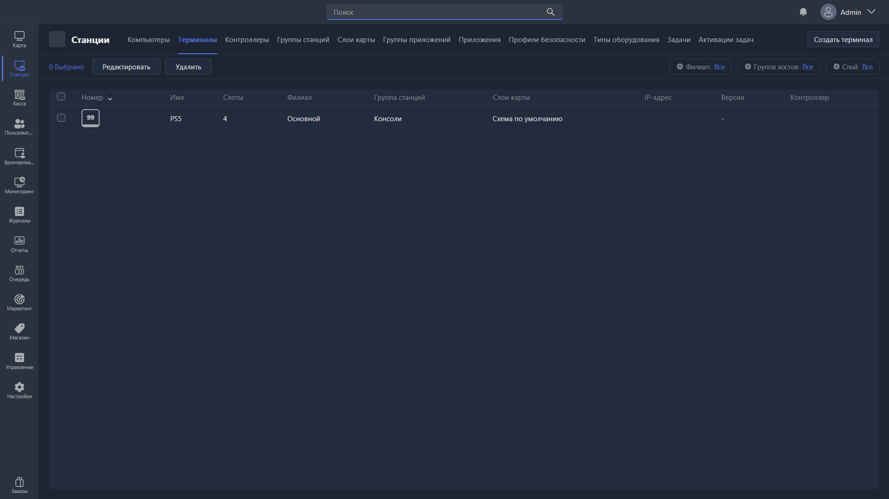

{width=1919px height=1079px}

Этот раздел позволяет управлять и добавлять Терминалы -- это игровые места в Gizmo, которые не могут быть подключены напрямую технически, но требуют проводить через них продажи для удобного контроля. Например, игровые консоли или бильярдные столы.

Устройства здесь не могут добавляться автоматически, их нужно создать вручную.

-  Редактировать -- открывает карточку редактирования выбранного терминала.

-  Удалить -- удаляет выбранные терминалы.

-  Создать терминал -- создает новый терминал.