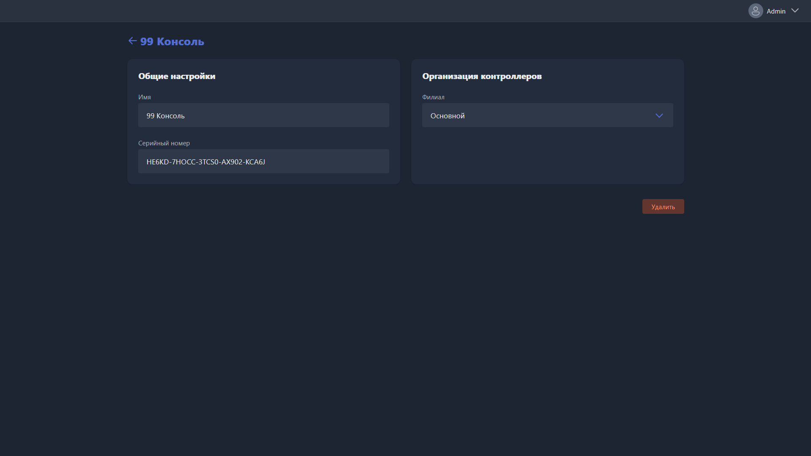

{width=1919px height=1079px}

Карточка открывается при создании нового контроллера или редактировании существующего.

-  **Имя** -- название контроллера в Gizmo.

-  **Серийный номер** -- номер, указанный на корпусе устройства. Используется, чтобы сопоставить запись в системе с физическим контроллером.

-  **Филиал** -- филиал, к которому привязан контроллер.