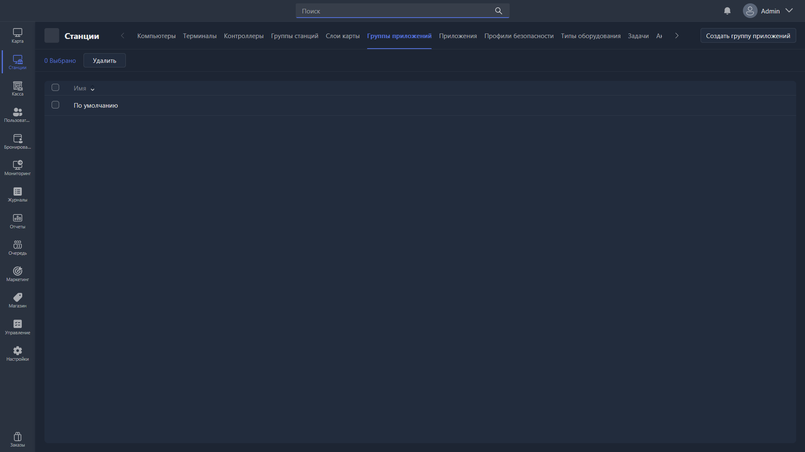

{width=1919px height=1079px}

Группа приложений объединяет несколько приложений в один набор, который можно назначить группе станций -- вместо того чтобы привязывать каждое приложение к каждой станции отдельно.

-  **Редактировать** -- открывает [карточку редактирования](./kartochka-redaktirovaniya-gruppy-prilozheniya.md) выбранной группы.

-  **Удалить** -- удаляет выбранные группы приложений.

-  **Создать группу приложений** -- создаёт группу и открывает карточку её редактирования.