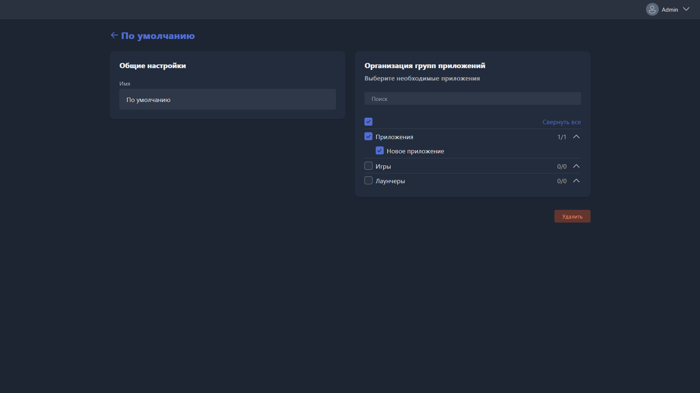

{width=1919px height=1079px}

Карточка открывается при создании новой группы приложений или редактировании существующей.

-  **Имя** -- название группы приложений.

-  **Организация групп приложений** -- вкладка с выбором приложений, которые входят в группу. Отметьте нужные приложения галочкой или найдите их через поиск.