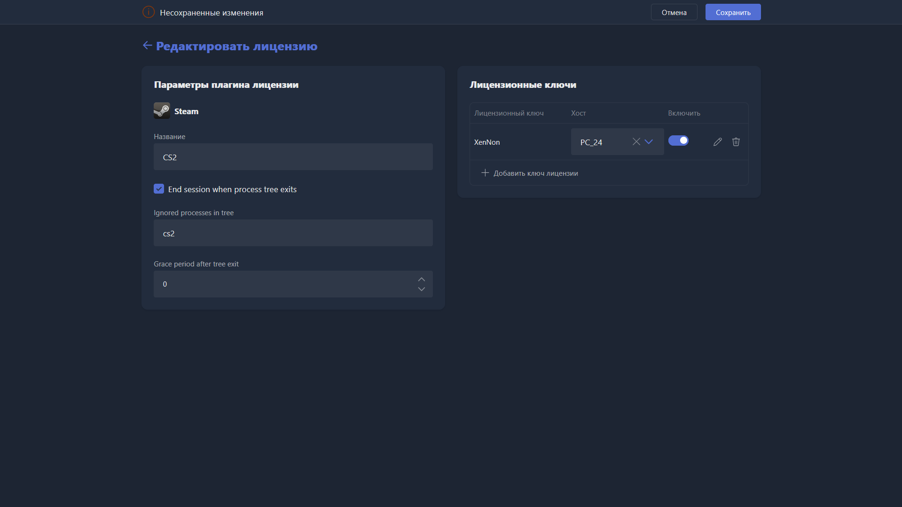

{width=1919px height=1079px}

Карточка открывается при создании нового профиля лицензий или редактировании существующего. Позволяет указать и использовать клубные лицензии для исполняемых файлов. Тип лицензии зависит от лаунчера -- поддерживаются не все лаунчеры.

> [!WARNING]
>
> Карточка не откроется, если на сервере не включён плагин лицензий. Откройте <cmd text="Настройки"/> -> <cmd text="Плагины"/> и убедитесь, что включён плагин **BaseLmPlugin**. Если он отключён -- включите его и обязательно перезапустите сервер и Gizmo Manager.

При создании карточки нужно выбрать лаунчер, для которого будет создана лицензия. Сменить лаунчер после создания профиля нельзя -- потребуется создать новый профиль.

-  **Battle.NET** -- игровой лаунчер Battle.NET.

-  **Command Line** -- лицензии для произвольного запуска через командную строку.

-  **EA Desktop** -- игровой лаунчер Electronic Arts (бывший Origin).

-  **Epic** -- игровой лаунчер Epic Games.

-  **Instance** -- ???

-  **Process** -- ???

-  **Registry** -- ???

-  **Registry Import** -- ???

-  **Riot** -- игровой лаунчер Riot Games.

-  **Steam** -- игровой лаунчер Valve.

-  **UBI Uplay** -- игровой лаунчер Ubisoft.

Поля профиля лицензий отличаются в зависимости от лаунчера. Рассмотрим их на примере Steam.

-  **Название** -- наименование профиля лицензий.

-  **End session when process tree exits** -- если включено и в поле **Ignored processes in tree** указан процесс (например, `cs2.exe`), при завершении этого процесса лаунчер автоматически закроется, а лицензия освободится.

-  **Ignored processes in tree** -- процессы, при завершении которых лаунчер закрывается, а лицензия освобождается. Указывайте точное название процесса, которое можно проверить в диспетчере задач Windows. Несколько процессов перечисляются через `;`.

-  **Grace period after tree exit** -- сколько система ждёт перед вводом лицензии в лаунчер.

-  **Лицензионные ключи** -- аккаунты для лицензии, добавляются кнопкой <cmd text="+ Добавить ключ лицензии"/>:

   -  **Username** -- логин учётной записи.

   -  **Password** -- пароль учётной записи.

   -  **Account ID** -- идентификатор учётной записи Steam. Больше не используется, поле можно оставить пустым.

-  После добавления ключа появляется строка с ним:

   -  **Хост** -- ПК, к которому можно привязать эту лицензию -- в этом случае она будет открываться только на нём. Если не выбрано, лицензия динамически распределяется между клиентскими ПК.

   -  **Включить** -- доступен ли лицензионный ключ для использования.