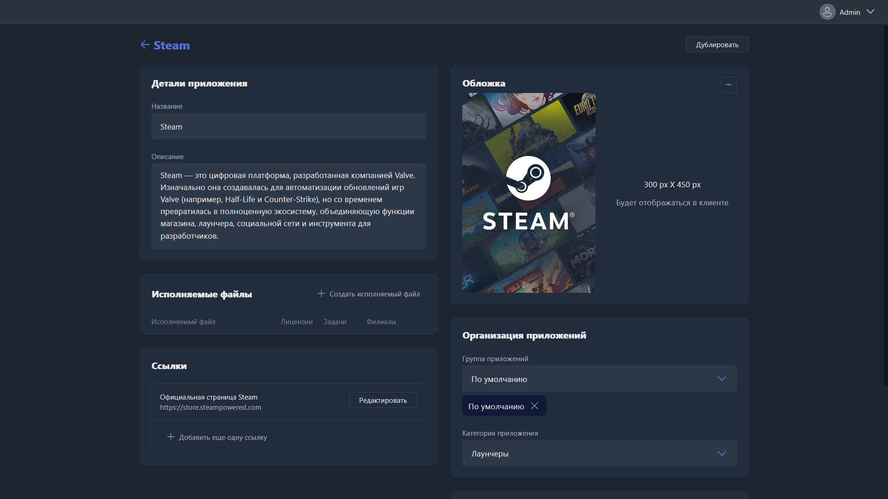

{width=1919px height=1079px}

Карточка открывается при создании нового приложения или редактировании существующего.

-  **Название** -- имя карточки приложения в списке приложений и в поиске клиентской оболочки.

-  **Описание** -- описание приложения, которое клиент увидит в оболочке при открытии деталей приложения.

-  **Исполняемые файлы** -- ярлыки запуска приложения. Кнопка <cmd text="+ Создать исполняемый файл"/> открывает [карточку редактирования исполняемого файла](./kartochka-redaktirovaniya-ispolnyaemogo-fayla/_index.md). Можно добавить любое количество исполняемых файлов -- например, один для запуска через «Личный аккаунт», другой -- через «Клубный аккаунт» той же игры.

-  **Ссылки** -- ссылки на источники, которые клиент увидит при открытии деталей приложения. Добавляются кнопкой <cmd text="Добавить ещё одну ссылку"/>. У каждой ссылки доступны поля:

   -  **Подпись** -- название ссылки в оболочке.

   -  **URL** -- адрес ссылки.

   -  **Описание** -- описание ссылки в оболочке.

-  **Обложка** -- изображение обложки приложения в клиентской оболочке. Рекомендуемое разрешение -- 300×450 px, но подойдёт любое с соотношением сторон 1 к 1,5.

-  **Группа приложений** -- группа, к которой привязано приложение. Если группа не выбрана, приложение не отобразится на игровых местах.

-  **Категория приложения** -- категория из тех, что вы создали, или заданных по умолчанию.

-  Дополнительно можно указать информацию, которую клиенты увидят при открытии деталей приложения в оболочке:

   -  **Версия** -- версия приложения.

   -  **Разработчик** -- разработчик приложения.

   -  **Издатель** -- издатель приложения.

   -  **Возрастной рейтинг** -- минимальный возраст для запуска. Если указан, и в <cmd text="Настройки"/> настроены возрастные ограничения, клиенты младше этого возраста не смогут запустить приложение.

   -  **Дата выхода** -- дата выхода приложения.

> [!WARNING]
>
> Перед созданием исполняемого файла сохраните карточку приложения. Переход к карточке исполняемого файла закрывает текущую карточку -- если она не была сохранена, изменения придётся вносить заново.
