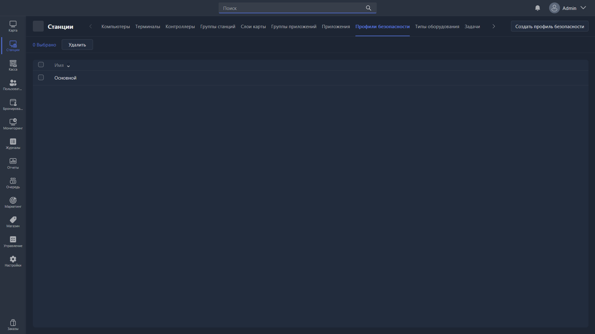

{width=1919px height=1079px}

Раздел отвечает за управление и создание профилей безопасности, используемых для ограничений на клиентских ПК. Профили безопасности могут блокировать функции системы так, чтобы клиент не имел никаких доступов на ПК, кроме оболочки и игр в ней, а также не мог снять оболочку.

## Список профилей

-  **Имя** -- название профиля безопасности.

## Действия

-  **Удалить** -- удаляет выбранные профили безопасности.

-  **Создать профиль безопасности** -- создаёт карточку профиля и открывает её редактирование.

Готовый профиль назначается станциям в [карточке группы станций](./../station-groups/station-group-card.md), поле **Профиль безопасности**. Полный перечень ограничений разобран в статье [«Карточка профиля безопасности»](./kartochka-redaktirovaniya-profilya-bezopasnosti.md).