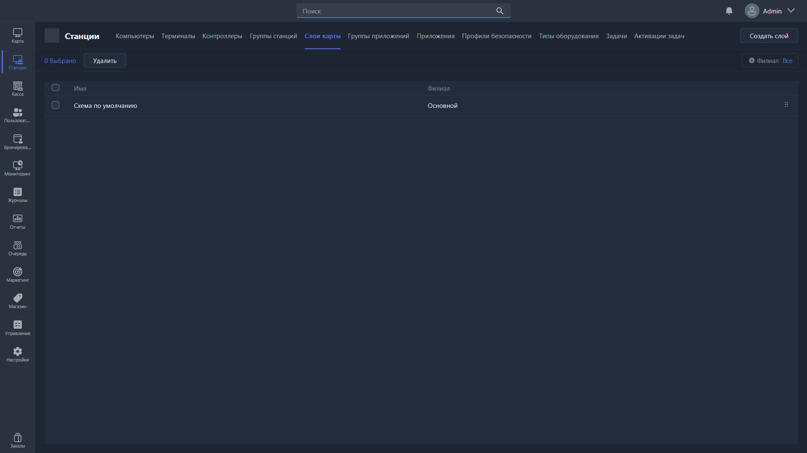

{width=1919px height=1079px}

Раздел отвечает за создание и управление слоями карты. На слои можно размещать игровые места, чтобы удобно переключаться между ними -- например, между 1 и 2 этажом клуба или разными его зонами.

-  **Редактировать** -- открывает [карточку редактирования](./kartochka-redaktirovaniya-sloya-karty.md) выбранного слоя.

-  **Удалить** -- удаляет выбранные слои карты.

-  **Создать слой** -- создаёт слой и открывает карточку его редактирования.