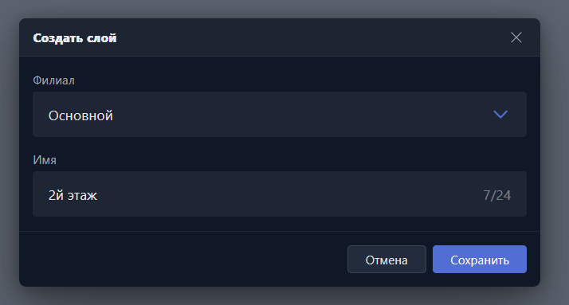

{width=714px height=383px}

Карточка открывается при создании нового слоя карты или редактировании существующего.

-  **Филиал** -- филиал, в котором будет доступен слой.

-  **Имя** -- название слоя в списке слоёв и в разделе <cmd text="Карта"/>.