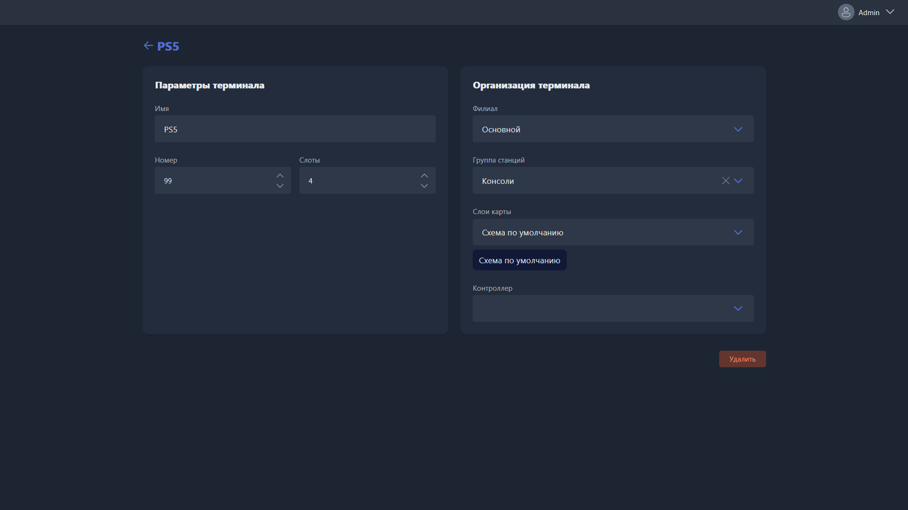

{width=1919px height=1079px}

Карточка открывается при ручном создании нового терминала или редактировании существующего.

-  **Имя** -- название терминала, отображается в списке станций, на карте клуба и в результатах поиска.

-  **Номер** -- порядковый номер терминала в Gizmo.

-  **Слоты** -- количество клиентов, которые могут быть одновременно авторизованы на этом терминале.

-  **Филиал** -- филиал, в котором отображается этот терминал.

-  **Группа станций** -- группа, в которую входит терминал. Определяет стоимость почасовой оплаты, доступные пакеты времени и применяемый профиль безопасности.

-  **Слои карты** -- слои, на которых терминал отображается в разделе <cmd text="Карта"/>.

-  **Контроллер** -- контроллер, привязанный к терминалу. Требуется для удалённого включения и выключения HDMI-сигнала на этом месте.